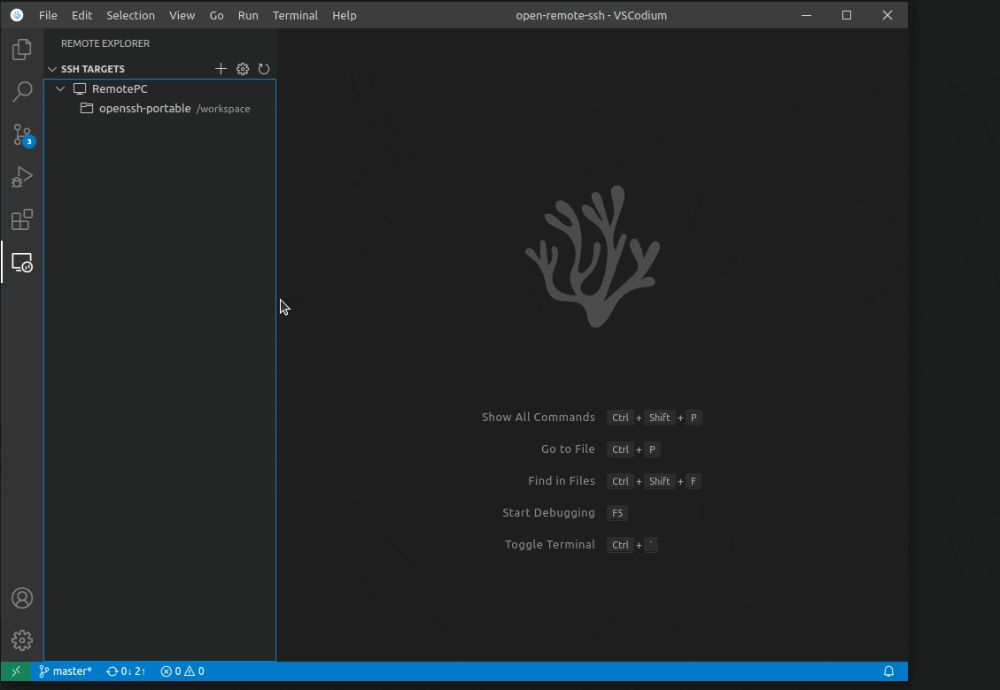

# Open Remote - SSH

A powerful VS Code extension that enables seamless remote development over SSH. Connect to any remote machine, virtual machine, or container with an SSH server and take advantage of VS Code's full feature set.



## 🚀 Features

### Core Capabilities

- **🌐 Remote Development Environment**: Connect to any remote machine, VM, or container with SSH server
- **⚡ Full VS Code Feature Set**: Complete IntelliSense, code navigation, debugging, and extensions support
- **📁 Remote File System Provider**: Browse, open, and edit remote files as if they were local
- **🖥️ Integrated Terminal**: All terminals automatically run on the remote host
- **🔧 SSH Configuration Support**: Seamlessly integrates with OpenSSH config files
- **🔌 Extension Management**: Install and manage VS Code extensions directly on remote hosts
- **🔐 Secure Connections**: Support for password and key-based authentication

### Platform Support

- **Linux**: x86_64 Debian, Ubuntu, CentOS/RHEL, ARMv7l (AArch32) Raspbian, ARMv8l (AArch64) Ubuntu
- **Windows**: Windows 10/11+ with OpenSSH
- **macOS**: 10.14+ (Mojave and later)
- **BSD**: FreeBSD, DragonFlyBSD

## 📋 Requirements

### Local Machine
- VS Code 1.74.0 or higher (or compatible editors like PearAI, VSCodium, etc.)
- Network connectivity to remote host

### Remote Machine
- SSH server installed and running
- One of the supported platforms listed above
- SSH access credentials (password or private key)

## 🛠️ Installation

### For PearAI - AI Code Editor

1. **Open PearAI**
2. **Access Extensions**: 
   - Click on the Extensions icon in the sidebar
   - Or press `Ctrl+Shift+X` (Windows/Linux) or `Cmd+Shift+X` (macOS)
3. **Search for Extension**: Type "Open Remote SSH" in the search bar
4. **Install**: Click the Install button
5. **Reload if Required**: Some versions may require a reload

### For VS Code and Other Compatible Editors

#### Method 1: Install from Marketplace
1. Open your code editor
2. Go to Extensions view (`Ctrl+Shift+X` / `Cmd+Shift+X`)
3. Search for "Open Remote SSH"
4. Click Install

#### Method 2: Install from VSIX
1. Download the `.vsix` file from the [releases page](https://github.com/sufian-dev/open-remote-ssh/releases)
2. Open Command Palette (`Ctrl+Shift+P` / `Cmd+Shift+P`)
3. Run "Extensions: Install from VSIX..."
4. Select the downloaded `.vsix` file

#### Method 3: Manual Installation
```bash
# Clone the repository
git clone https://github.com/sufian-dev/open-remote-ssh.git

# Navigate to the project directory
cd open-remote-ssh

# Install dependencies
npm install

# Package the extension
npm run package

# Install the generated VSIX file
code --install-extension open-remote-ssh-*.vsix
```

## 📖 Usage

### Quick Start

1. **Open Command Palette**: `Ctrl+Shift+P` / `Cmd+Shift+P`
2. **Run Command**: "Remote-SSH: Connect to Host..."
3. **Select Host**: Choose from SSH config or enter details manually
4. **Authenticate**: Enter password or use SSH key
5. **Start Coding**: Your editor opens with remote folder

### Step-by-Step Guide

#### 1. Configure SSH Host (Optional)
Create or edit `~/.ssh/config`:

```ssh
Host my-remote-server
    HostName 192.168.1.100
    User myusername
    Port 22
    IdentityFile ~/.ssh/id_rsa
```

#### 2. Connect to Remote Host
- **Command Palette**: Press `Ctrl+Shift+P` / `Cmd+Shift+P`
- **Type**: "Remote-SSH: Connect to Host..."
- **Select**: Choose your configured host or "Manual Connection"

#### 3. Authentication
- For password auth: Enter password when prompted
- For key-based auth: Ensure your SSH key has proper permissions:
  ```bash
  chmod 600 ~/.ssh/id_rsa
  ```

#### 4. Remote Workspace
Once connected, you can:
- Browse remote files in the Explorer
- Edit files with full IntelliSense support
- Open integrated terminals (automatically on remote)
- Debug applications running on remote
- Install extensions on remote host

### Available Commands

- `Remote-SSH: Connect to Host...` - Connect to a remote SSH host
- `Remote-SSH: Disconnect from Host` - Disconnect current session
- `Remote-SSH: Open Terminal` - Open terminal on remote host
- `Remote-SSH: Settings` - Open extension settings
- `Remote-SSH: Show Log` - View connection logs

### Remote Explorer

The extension adds a "Remote Explorer" view to the Activity Bar:
1. Click the Remote Explorer icon
2. View all configured SSH hosts
3. Click on a host to connect
4. Right-click for more options

## ⚙️ Configuration

Access settings through your editor's settings or `settings.json`:

| Setting | Type | Default | Description |
|---------|------|---------|-------------|
| `remote-ssh.configFile` | string | `~/.ssh/config` | Path to SSH configuration file |
| `remote-ssh.showLoginTerminal` | boolean | `false` | Show terminal during connection process |
| `remote-ssh.defaultExtensions` | array | `[]` | Extensions to install on remote by default |
| `remote-ssh.connectTimeout` | number | `15000` | Connection timeout in milliseconds |

### Example Configuration

```json
{
    "remote-ssh.configFile": "~/.ssh/config",
    "remote-ssh.showLoginTerminal": true,
    "remote-ssh.defaultExtensions": [
        "dbaeumer.vscode-eslint",
        "esbenp.prettier-vscode"
    ],
    "remote-ssh.connectTimeout": 30000
}
```

## 🎯 Use Cases

- **Development on Deployment OS**: Work directly on the same OS as production
- **Resource-Intensive Tasks**: Use powerful remote servers for heavy computation
- **Consistent Environment**: Share development environments across team
- **IoT Development**: Develop directly on Raspberry Pi or other devices
- **Cloud Development**: Connect to cloud VMs without local setup
- **Multi-Machine Workflow**: Access different environments from one editor

## 🔍 Troubleshooting

### Connection Issues

1. **Verify SSH Access**: Test connection via terminal first
   ```bash
   ssh user@hostname
   ```

2. **Check SSH Config**: Ensure config file syntax is correct

3. **Firewall/Network**: Verify port 22 (or custom port) is accessible

4. **Authentication**: Ensure correct credentials or key permissions
   ```bash
   chmod 600 ~/.ssh/id_rsa
   ```

### Performance Tips

- Use connection multiplexing in SSH config
- Keep stable network connection
- Consider using tmux/screen for persistent sessions
- Install only necessary extensions on remote

### Common Issues

**Issue**: Extension not appearing in PearAI/other editors
- **Solution**: Ensure your editor supports VS Code extensions
- Check compatibility with your editor version

**Issue**: "Host key verification failed"
- **Solution**: Add host to known_hosts:
  ```bash
  ssh-keyscan -H hostname >> ~/.ssh/known_hosts
  ```

**Issue**: Connection timeout
- **Solution**: Increase timeout in settings or check network connectivity

## 🤝 Contributing

Contributions are welcome! Please feel free to submit issues and pull requests.

### Development Setup

```bash
# Clone repository
git clone https://github.com/sufian-dev/open-remote-ssh.git

# Install dependencies
npm install

# Compile
npm run compile

# Run tests
npm test

# Package extension
npm run package
```

## 📄 License

This project is licensed under the MIT License - see the [LICENSE](LICENSE) file for details.

## 🙏 Acknowledgments

- Inspired by Microsoft's Remote-SSH extension
- Built for the open-source community
- Special focus on compatibility with PearAI and other VS Code forks
- Thanks to all contributors and users

## 📞 Support

- **Issues**: [GitHub Issues](https://github.com/sufian-dev/open-remote-ssh/issues)
- **Discussions**: [GitHub Discussions](https://github.com/sufian-dev/open-remote-ssh/discussions)

---

**Note**: This extension is designed to work with any VS Code-compatible editor, including:
- PearAI - AI Code Editor
- VSCodium
- Code - OSS
- And other VS Code forks

For editor-specific installation instructions, please refer to your editor's documentation on installing VS Code extensions.